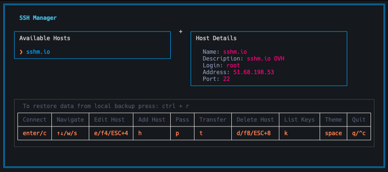
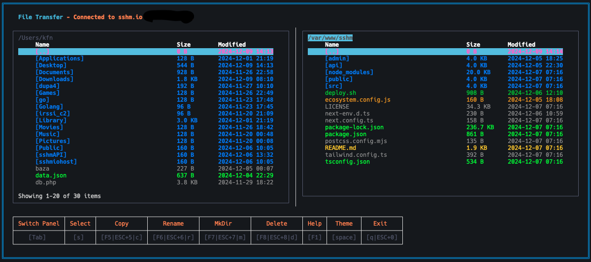

# SSH Manager (sshm)

[](LICENSE)
[](https://go.dev/)
[]()

A modern, secure, terminal-based SSH connection manager with an intuitive TUI interface, encrypted credential storage, and optional cloud synchronization capabilities.



## 🚀 Features

### Core Functionality
- **🔐 Secure Credential Management**: AES-256-GCM encryption for passwords and SSH keys
- **📡 SSH Connection Management**: Quick connect to saved hosts with intuitive interface
- **📁 File Transfer**: Dual-pane SFTP/SCP file browser with batch operations
- **🔑 Multiple Authentication Methods**: Support for password and SSH key authentication
- **☁️ Cloud Synchronization**: Optional backup and sync with [sshm.io](https://sshm.io)
- **🎨 Customizable Themes**: Multiple color schemes for personalized experience
- **🖱️ Mouse Support**: Full mouse interaction including double-click actions
- **💾 Automatic Backups**: Safety backups before sync operations

### User Experience
- Beautiful terminal UI built with [Bubble Tea](https://github.com/charmbracelet/bubbletea) and [Lip Gloss](https://github.com/charmbracelet/lipgloss)
- Intuitive keyboard shortcuts inspired by popular file managers
- Interactive SSH sessions with proper terminal handling
- Real-time terminal resize support
- Session keep-alive for stable connections
- Cross-platform support (Linux, macOS, Windows - x64 & ARM64)



## 📦 Installation

### Prerequisites
- Go 1.23 or higher
- Terminal with UTF-8 and color support

### From Source

```bash
# Clone the repository
git clone https://github.com/kofany/sshmanager.git
cd sshmanager

# Build the application
go build -o sshm ./cmd/sshm/main.go

# Move to your PATH (optional)
sudo mv sshm /usr/local/bin/
```

### Cross-Platform Build

Build for all supported platforms using the provided script:

```bash
chmod +x build.sh
./build.sh
```

Binaries will be available in the `build/` directory for:
- Linux (amd64, arm64)
- macOS (amd64, arm64)
- Windows (amd64)

### Quick Start

```bash
# Run the application
./sshm

# Follow the prompts:
# 1. Enter a master password (used for encryption)
# 2. Optionally enter API key for cloud sync (or press ESC for local mode)
# 3. Start managing your SSH connections!
```

## 🎯 Quick Usage Guide

### First Run Setup

1. **Master Password**: Create a strong password for encrypting your credentials
2. **Cloud Sync (Optional)**: 
   - Register at [https://sshm.io](https://sshm.io) to get an API key
   - Enter the API key when prompted, or press `ESC` for local-only mode

### Basic Operations

#### Host Management
```
h       - Add new host
e / F4  - Edit selected host
d / F8  - Delete selected host
c / ↵   - Connect to selected host
t       - Enter file transfer mode
```

#### Navigation
```
↑↓ / ws - Navigate lists
Tab     - Switch between panels
ESC     - Go back / Cancel
q       - Quit application
Space   - Switch color theme
```

#### File Transfer Mode
```
Tab     - Switch between local/remote panels
F5 / c  - Copy file or directory
F6 / r  - Rename file or directory
F7 / m  - Create new directory
F8 / d  - Delete file or directory
s       - Select/deselect for batch operations
↵       - Navigate into directory
q       - Return to main view
```

**Pro Tip**: Function keys can also be triggered with `ESC + [number]` (e.g., `ESC + 5` for F5)

#### Password & Key Management
```
p       - Open password management
k       - Open SSH key management
a       - Add new item (when in management view)
e       - Edit selected item
d       - Delete selected item
```

### Mouse Support

The application features comprehensive mouse support:
- **Left Click**: Select items, focus fields, switch panels
- **Double Click**: 
  - Main view: Connect to host
  - File transfer: Navigate into directory
- **Scroll Wheel**: Scroll through lists

## ⚙️ Configuration

### Storage Locations

Configuration and credentials are stored in:

- **Linux/macOS**: `~/.config/sshm/`
- **Windows**: `%USERPROFILE%\.config\sshm\`

### Files Structure

```
~/.config/sshm/
├── ssh_hosts.json    # Encrypted host configurations
├── api_key.txt       # Encrypted API key (if using cloud sync)
└── keys/             # Stored SSH private keys
    ├── key_1.pem
    └── key_2.pem
```

### Security

All sensitive data is encrypted using **AES-256-GCM** encryption:
- Passwords are encrypted at rest
- SSH private keys are encrypted
- API key is encrypted
- Encryption key is derived from your master password

**Important**: 
- Never share your master password
- Keep backups of your `~/.config/sshm/` directory
- SSH key files are stored with `0600` permissions

## 🏗️ Architecture

### Technology Stack

- **Language**: Go 1.23
- **UI Framework**: [Bubble Tea](https://github.com/charmbracelet/bubbletea) (TUI framework)
- **Styling**: [Lip Gloss](https://github.com/charmbracelet/lipgloss)
- **SSH**: [golang.org/x/crypto/ssh](https://pkg.go.dev/golang.org/x/crypto/ssh)
- **File Transfer**: [pkg/sftp](https://github.com/pkg/sftp), [go-scp](https://github.com/bramvdbogaerde/go-scp)
- **Encryption**: AES-256-GCM (Go standard library)

### Project Structure

```
sshmanager/
├── cmd/sshm/            # Application entry point
│   └── main.go
├── internal/
│   ├── config/          # Configuration management
│   ├── crypto/          # Encryption/decryption
│   ├── models/          # Data models
│   ├── ssh/             # SSH client and operations
│   ├── sync/            # Cloud synchronization
│   ├── ui/              # UI components and state
│   │   ├── messages/    # Tea messages
│   │   ├── styles/      # UI styles
│   │   └── views/       # Application views
│   └── utils/           # Utility functions
├── docs/                # Project documentation
├── screenshots/         # Application screenshots
├── build.sh             # Cross-platform build script
├── CHANGELOG.md         # Release notes
└── README.md
```

## 📚 Documentation

Comprehensive documentation is available in the [docs/](docs/README.md) directory:

- [Installation Guide](docs/INSTALLATION.md)
- [User Guide](docs/USER_GUIDE.md)
- [Architecture Overview](docs/ARCHITECTURE.md)
- [Security Guide](docs/SECURITY.md)
- [Contributing Guide](docs/CONTRIBUTING.md)

## 🔒 Security Best Practices

1. **Strong Master Password**: Use a unique, complex password
2. **SSH Key Permissions**: Ensure key files have proper permissions (0600)
3. **Regular Backups**: Keep encrypted backups of your config directory
4. **Cloud Sync**: Only use trusted cloud sync services
5. **Audit**: Regularly review stored credentials and remove unused ones
6. **Updates**: Keep the application updated for security patches

## 🌐 Cloud Synchronization

### Setup

1. Visit [https://sshm.io](https://sshm.io) and register an account
2. Generate an API key from your dashboard
3. Enter the API key when starting sshm for the first time
4. Your configuration will automatically sync across devices

### Features

- **Automatic Sync**: Changes are synced on save
- **Safety Backups**: Local backups created before sync
- **Conflict Resolution**: Automatic handling of sync conflicts
- **Local Mode**: Option to work offline (press ESC at API prompt)

### Self-Hosting

The cloud sync service is open source. You can host your own instance:
- Repository: [https://github.com/kofany/sshm.io](https://github.com/kofany/sshm.io)
- Official instance: [https://sshm.io](https://sshm.io)

## 🐛 Troubleshooting

### Connection Issues

**Problem**: Cannot connect to SSH host
- Verify host address and port
- Check network connectivity
- Ensure credentials are correct
- Verify SSH service is running on target host

### Sync Problems

**Problem**: Cloud sync fails
- Verify API key is correct
- Check internet connection
- Ensure backup files exist in config directory
- Try deleting `api_key.txt` and re-entering

### Permission Errors

**Problem**: Permission denied when using SSH keys
- Check key file permissions: `chmod 600 ~/.config/sshm/keys/*`
- Verify you have access rights on remote host
- Ensure key is in correct format (OpenSSH or PEM)

### Display Issues

**Problem**: UI appears corrupted
- Ensure terminal supports UTF-8
- Try different color theme (press `Space`)
- Resize terminal window
- Check terminal compatibility (xterm, xterm-256color recommended)

## 🤝 Contributing

Contributions are welcome! Please feel free to submit issues, feature requests, or pull requests.

### Development Setup

```bash
# Clone the repository
git clone https://github.com/kofany/sshmanager.git
cd sshmanager

# Install dependencies
go mod download

# Run the application
go run ./cmd/sshm/main.go

# Run tests (if available)
go test ./...
```

### Code Style

- Follow standard Go conventions
- Use `gofmt` for formatting
- Add comments for exported functions
- Write tests for new features

## 📝 License

This project is licensed under the **GNU General Public License v3.0** (GPL-3.0).

See the [LICENSE](LICENSE) file for full license text.

### What this means:
- ✅ You can use this software freely
- ✅ You can modify the source code
- ✅ You can distribute copies
- ⚠️ You must disclose the source code of any modifications
- ⚠️ You must use the same GPL-3.0 license for derivatives
- ⚠️ You must include the original license and copyright notice

## 📧 Support & Contact

- **Issues**: [GitHub Issues](https://github.com/kofany/sshmanager/issues)
- **Email**: [j@dabrowski.biz](mailto:j@dabrowski.biz)
- **Cloud Service**: [https://sshm.io](https://sshm.io)

## 🙏 Acknowledgments

This project uses excellent open-source libraries:

- [Bubble Tea](https://github.com/charmbracelet/bubbletea) by Charm
- [Lip Gloss](https://github.com/charmbracelet/lipgloss) by Charm
- [go-scp](https://github.com/bramvdbogaerde/go-scp) by Bram Vandenbogaerde
- [pkg/sftp](https://github.com/pkg/sftp) by pkg team
- [golang.org/x/crypto](https://pkg.go.dev/golang.org/x/crypto) by Go team

Special thanks to all contributors and users of this project!

---

**Made with ❤️ by the SSH Manager team**

*Star ⭐ this repository if you find it useful!*
